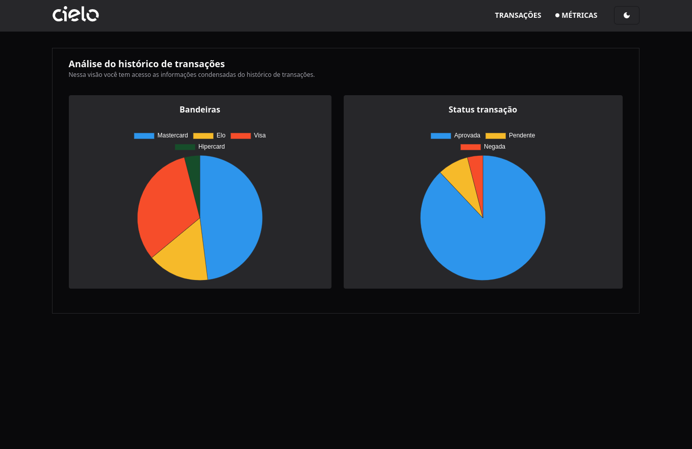

# CIELO HISTÓRICO DE TRANSAÇÕES


> Esta é uma aplicação desenvolvida para o bootcamp da Cielo, com intuito de comprovar conhecimentos em frontend.

<div style="width:100%; display:flex; align-items:center; gap:16px; flex-direction: column;">    
                
</div>

## Detalhes da aplicação

- O projeto consiste em duas visões, uma para apresentar o histórico de transações em forma de tabela, na qual 
pode ser vista cada transação em detalhes. E a outra visão que mostra informações sobre o histórico de transações em forma
de gráficos, para que possa facilitar a tomada de decisão.

## Tecnologias utilizadas

- Tailwindcss (Ferramenta para produtividade na estilização)
- Shadcn/UI (Lib de components para melhorar a produtividade)
- React
- React Icons (Biblioteca para ícones)


## Padrões abordados

- Foi escolhido o uso de uma biblioteca que utiliza a composição de componentes,
 utilizando esse padrão o código fica mais legível e de fácil manutenção. (Lib: Shadcn-ui)

- Para acessar a api foi utilizado o padrão criacional `Singleton` que permite ter apenas uma instancia do objeto.

## 💻 Como rodar o projeto
Para utilizar e testar o projeto, esteja em um computador com Node Js instalado e siga as
etapas abaixo:

- OBS: necessário node 18 instalado na máquina.

1 Clone o projeto com o comando
```
git clone https://github.com/IgorAlvesR/cielo-payments.git
```
2 Acesse o projeto da UI pelo terminal com o comando
```
cd cielo-payments/web-payments 
```
3 Instale as dependências necessárias com o comando
```
npm install
```
4 Crie uma arquivo `.env` no diretório `cielo-payments/web-payments` que contém a seguinte env
```
VITE_API_URL=(endereço da api, ex: http://localhost:3000)
```
5 Acesse o diretório que contém a api
```
cd cielo-payments/api-payments
```
6 Instale as dependências necessárias com o comando
```
npm install
```
7 Rode o seguite comando para subir a api no diretório `cielo-payments/api-payments`
```
npm start
```
8 Rode o seguinte comando para subir a UI do projeto no diretório `cielo-payments/web-payments`
```
npm run dev
```
9 Acesse o projeto
```
http://localhost:5173
```
10 Para rodar os testes unitários do projeto execute o seguinte comando no diretório `cielo-payments/web-payments`
```
npm run test
```

## 🌐 Links úteis
[NodeJS](https://nodejs.org/en/download)
[Tailwind](https://tailwindcss.com/)
[ShadcnUI](https://ui.shadcn.com/)
[ReactIcons](https://react-icons.github.io/react-icons/)


## 🧑‍💻 Igor Alves Rodrigues

[](https://www.linkedin.com/in/igor-alves-rodrigues-7941a116b/)
[](https://gthub.com/igoralvesr)
[](http://wa.me/5548998434969)
[](https://igoralvesr.github.io)